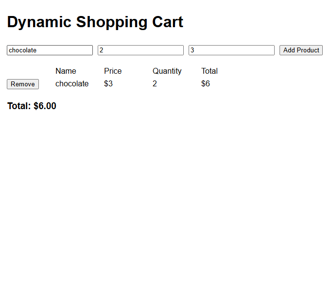

## Table of contents

- [Overview](#overview)
  - [The challenge](#the-challenge)
  - [Screenshot](#screenshot)
  - [Links](#links)
- [My process](#my-process)
  - [Built with](#built-with)
  - [What I learned](#what-i-learned)
  - [Continued development](#continued-development)
  - [Useful resources](#useful-resources)
  - [Reflection Questions](#reflection-questions)

## Overview

### The challenge

Users should be able to:

1. Add Products with different names and prices.
2. Ensure each product appears in the list with the correct price.
3. Remove Products from the cart.
4. Total price updates accurately after removing items.
5. Can't add products with empty names or invalid prices.

### Screenshot

### Links

- Github URL: (https://github.com/Shelley960/contact-form-main)

## My process

### Built with

- Semantic HTML5 markup
- CSS custom properties
- Flexbox
- javascript

### What I learned

Understand more how to use DOM with HTML, css, and javascript.  

### Continued development

I need to practice more so I can finish faster.

### Useful resources

- [Per Scholas](https://ps-lms.vercel.app/curriculum/se/412) - This helped me understand how to use DOM.  It is simplify for me to understand.  
- [w3schools](https://www.ew3schools.com) - This is another good site that help me understand how to use DOM, HTML, javascript, and css.

### Reflection Questions:

1. How did you dynamically create and append new elements to the DOM?
    1. User will input the value.  
    2. I will use getElementById to assign to a value. 
    3. Check did user put in the correct value.
    4. Put in the array
    5. Display the array 
2. What steps did you take to ensure accurate updates to the total price?
    At nedd to mulitple the price and quantity to get the total amount for just that item.  I need to use console.log to make sure the amount is accurate.  Then we call the updateTotalPrice function to calculate all item total amount.  
3. How did you handle invalid input for product name or price?
    I need to think up the logic first before google search how to do it.  At first I try to use Number.isInteger() for the Quantity but I can't make it work so I think to check is there decimal in there.  Then, I need to know how to use Regex to check is the input price is whole number and/or two decimal number.   
4. What challenges did you face when implementing the remove functionality?
    I need to understand what is the remove fucntion doing first.  Then, I need to figure out how to call this function to remove the item in the list.  